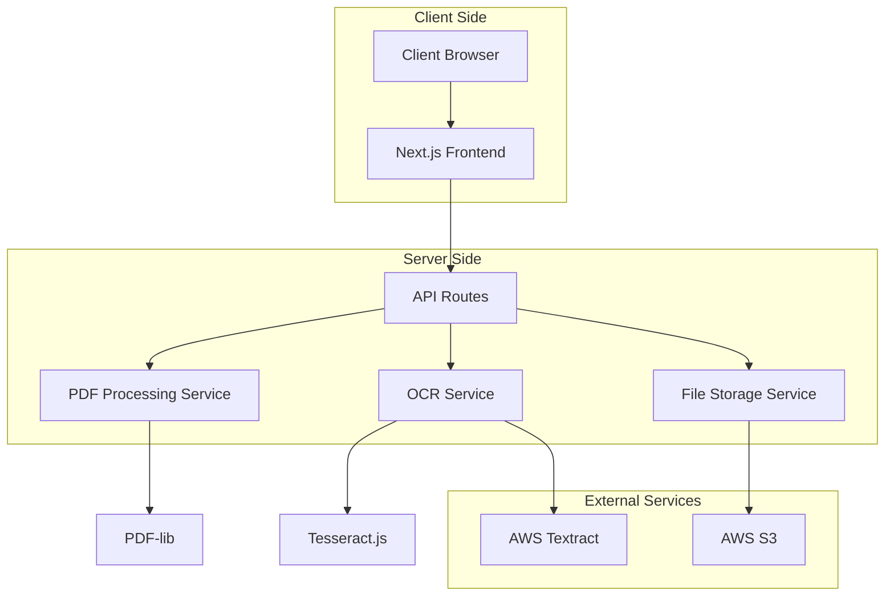

# Design Document

## Overview

PDFixr1 is a Next.js-based web application that provides comprehensive PDF editing capabilities. The system architecture follows a modern client-server pattern with cloud storage integration, leveraging React for the frontend, Node.js APIs for backend processing, and AWS services for storage and OCR functionality.

The application will use PDF-lib for PDF manipulation, React-PDF for viewing, Canvas API for annotations, and integrate with both Tesseract.js (client-side) and AWS Textract (server-side) for OCR processing.

## Architecture

### High-Level Architecture



### Technology Stack

**Frontend:**
- Next.js 14 with App Router
- React 18 with TypeScript
- Tailwind CSS for styling with custom design system
- Framer Motion for smooth animations
- React-PDF for PDF rendering
- Fabric.js for canvas-based annotations
- React Query for state management and caching
- Radix UI for accessible component primitives
- Lucide React for consistent iconography

**Backend:**
- Next.js API Routes
- PDF-lib for PDF manipulation
- Tesseract.js for client-side OCR
- AWS SDK for S3 and Textract integration
- Sharp for image processing

**Storage & Services:**
- AWS S3 for file storage
- AWS Textract for advanced OCR
- Redis for session caching (optional)

## UI/UX Design System

### Design Principles
- **Minimalist & Clean**: Focus on content with minimal visual clutter
- **Dark Mode First**: Modern dark theme with optional light mode
- **Responsive**: Seamless experience across desktop, tablet, and mobile
- **Accessible**: WCAG 2.1 AA compliance with keyboard navigation
- **Performance**: Smooth 60fps animations and interactions

### Color Palette
```css
/* Dark Theme (Primary) */
--background: #0a0a0a;
--surface: #1a1a1a;
--surface-elevated: #2a2a2a;
--border: #333333;
--text-primary: #ffffff;
--text-secondary: #a3a3a3;
--accent: #3b82f6;
--accent-hover: #2563eb;
--success: #10b981;
--warning: #f59e0b;
--error: #ef4444;

/* Light Theme (Secondary) */
--background-light: #ffffff;
--surface-light: #f8fafc;
--surface-elevated-light: #f1f5f9;
--border-light: #e2e8f0;
--text-primary-light: #0f172a;
--text-secondary-light: #64748b;
```

### Typography
```css
/* Font Stack */
font-family: 'Inter', -apple-system, BlinkMacSystemFont, 'Segoe UI', sans-serif;

/* Type Scale */
--text-xs: 0.75rem;    /* 12px */
--text-sm: 0.875rem;   /* 14px */
--text-base: 1rem;     /* 16px */
--text-lg: 1.125rem;   /* 18px */
--text-xl: 1.25rem;    /* 20px */
--text-2xl: 1.5rem;    /* 24px */
--text-3xl: 1.875rem;  /* 30px */
```

### Layout Structure

#### Main Application Layout
```
┌─────────────────────────────────────────────────────────┐
│ Header (60px)                                           │
│ ┌─────────────┐ ┌─────────────┐ ┌─────────────────────┐ │
│ │ Logo        │ │ File Actions│ │ User Menu           │ │
│ └─────────────┘ └─────────────┘ └─────────────────────┘ │
├─────────────────────────────────────────────────────────┤
│ Toolbar (48px)                                          │
│ ┌─────┐ ┌─────┐ ┌─────┐ ┌─────┐ ┌─────┐ ┌─────────────┐ │
│ │ Sel │ │ Ann │ │ Text│ │ Img │ │ Exp │ │ Zoom        │ │
│ └─────┘ └─────┘ └─────┘ └─────┘ └─────┘ └─────────────┘ │
├─────────────────────────────────────────────────────────┤
│ Main Content Area                                       │
│ ┌─────────────┐ ┌─────────────────────────────────────┐ │
│ │ Sidebar     │ │ PDF Viewer                          │ │
│ │ (280px)     │ │                                     │ │
│ │             │ │                                     │ │
│ │ - Thumbnails│ │                                     │ │
│ │ - Layers    │ │                                     │ │
│ │ - Properties│ │                                     │ │
│ │             │ │                                     │ │
│ └─────────────┘ └─────────────────────────────────────┘ │
└─────────────────────────────────────────────────────────┘
```

### Component Design Specifications

#### Header Component
- **Height**: 60px
- **Background**: Translucent with backdrop blur
- **Logo**: Modern wordmark with icon
- **Actions**: Floating button group with subtle shadows
- **User Menu**: Avatar with dropdown, smooth transitions

#### Toolbar Component
- **Height**: 48px
- **Style**: Floating toolbar with rounded corners
- **Tools**: Icon-only buttons with tooltips
- **Active State**: Subtle background highlight
- **Grouping**: Visual separation between tool categories

#### PDF Viewer Component
- **Background**: Subtle texture or gradient
- **PDF Pages**: Drop shadow with rounded corners
- **Zoom Controls**: Floating controls in bottom-right
- **Loading**: Skeleton screens with shimmer effect
- **Annotations**: Smooth hover states and selection

#### Sidebar Component
- **Width**: 280px (collapsible to 60px)
- **Sections**: Accordion-style with smooth animations
- **Thumbnails**: Grid layout with hover effects
- **Properties Panel**: Form controls with modern styling

### Animation & Interactions

#### Micro-interactions
```typescript
// Framer Motion variants
const buttonVariants = {
  hover: { scale: 1.02, transition: { duration: 0.2 } },
  tap: { scale: 0.98, transition: { duration: 0.1 } }
};

const slideVariants = {
  enter: { x: 300, opacity: 0 },
  center: { x: 0, opacity: 1 },
  exit: { x: -300, opacity: 0 }
};
```

#### Page Transitions
- Smooth fade transitions between views
- Staggered animations for list items
- Loading states with skeleton screens
- Error states with retry animations

#### Tool Interactions
- Hover effects on all interactive elements
- Smooth tool switching with state persistence
- Contextual menus with slide-in animations
- Drag and drop with visual feedback

### Responsive Design

#### Breakpoints
```css
/* Mobile First Approach */
--mobile: 320px;
--tablet: 768px;
--desktop: 1024px;
--wide: 1440px;
```

#### Mobile Adaptations
- Collapsible sidebar becomes bottom sheet
- Toolbar becomes horizontal scroll
- Touch-optimized button sizes (44px minimum)
- Gesture support for zoom and pan

#### Tablet Adaptations
- Sidebar remains visible but narrower
- Toolbar groups collapse intelligently
- Touch and mouse input support

### Accessibility Features
- High contrast mode support
- Keyboard navigation with focus indicators
- Screen reader optimized markup
- Reduced motion preferences respected
- Color blind friendly palette

## Components and Interfaces

### Core Components

#### 1. PDF Viewer Component
```typescript
interface PDFViewerProps {
  fileUrl: string;
  onPageChange: (page: number) => void;
  onTextSelect: (selection: TextSelection) => void;
  annotations: Annotation[];
  editMode: boolean;
  theme: 'dark' | 'light';
  zoomLevel: number;
  onZoomChange: (zoom: number) => void;
  loading?: boolean;
  className?: string;
}
```

#### 2. Annotation Toolbar Component
```typescript
interface AnnotationToolbarProps {
  activeTools: AnnotationTool[];
  onToolSelect: (tool: AnnotationTool) => void;
  onColorChange: (color: string) => void;
  onUndo: () => void;
  onRedo: () => void;
  isFloating?: boolean;
  position?: 'top' | 'bottom';
  theme: 'dark' | 'light';
  disabled?: boolean;
  shortcuts?: boolean;
}
```

#### 3. Text Editor Component
```typescript
interface TextEditorProps {
  textContent: string;
  position: { x: number; y: number };
  onTextChange: (text: string) => void;
  onPositionChange: (position: { x: number; y: number }) => void;
  formatting: TextFormatting;
}
```

#### 4. Image Manager Component
```typescript
interface ImageManagerProps {
  images: PDFImage[];
  onImageAdd: (image: File) => void;
  onImageEdit: (id: string, changes: ImageChanges) => void;
  onImageDelete: (id: string) => void;
}
```

#### 5. Export Manager Component
```typescript
interface ExportManagerProps {
  pdfData: PDFData;
  onExport: (format: ExportFormat, options: ExportOptions) => void;
  supportedFormats: ExportFormat[];
}
```

### Service Interfaces

#### PDF Processing Service
```typescript
interface PDFProcessingService {
  loadPDF(file: File): Promise<PDFDocument>;
  addAnnotation(pdf: PDFDocument, annotation: Annotation): Promise<PDFDocument>;
  editText(pdf: PDFDocument, textEdit: TextEdit): Promise<PDFDocument>;
  addImage(pdf: PDFDocument, image: ImageData): Promise<PDFDocument>;
  exportToPDF(pdf: PDFDocument): Promise<Blob>;
}
```

#### OCR Service
```typescript
interface OCRService {
  extractText(image: ImageData, options: OCROptions): Promise<OCRResult>;
  processPage(pdfPage: PDFPage): Promise<TextLayer>;
  getBoundingBoxes(text: string, page: PDFPage): Promise<BoundingBox[]>;
}
```

#### Storage Service
```typescript
interface StorageService {
  uploadFile(file: File, metadata: FileMetadata): Promise<string>;
  downloadFile(fileId: string): Promise<Blob>;
  deleteFile(fileId: string): Promise<void>;
  listFiles(userId: string): Promise<FileInfo[]>;
}
```

## Data Models

### PDF Document Model
```typescript
interface PDFDocument {
  id: string;
  filename: string;
  pages: PDFPage[];
  metadata: PDFMetadata;
  annotations: Annotation[];
  textLayers: TextLayer[];
  images: PDFImage[];
  createdAt: Date;
  updatedAt: Date;
}
```

### Annotation Model
```typescript
interface Annotation {
  id: string;
  type: 'highlight' | 'underline' | 'strikethrough' | 'note' | 'shape';
  pageNumber: number;
  coordinates: BoundingBox;
  content?: string;
  style: AnnotationStyle;
  createdAt: Date;
}
```

### Text Layer Model
```typescript
interface TextLayer {
  pageNumber: number;
  textItems: TextItem[];
  ocrConfidence?: number;
  isEditable: boolean;
}

interface TextItem {
  id: string;
  text: string;
  coordinates: BoundingBox;
  formatting: TextFormatting;
  isOCRGenerated: boolean;
}
```

### Image Model
```typescript
interface PDFImage {
  id: string;
  pageNumber: number;
  coordinates: BoundingBox;
  imageData: string; // base64 or URL
  originalFilename: string;
  mimeType: string;
}
```

## Error Handling

### Error Types
```typescript
enum ErrorType {
  PDF_LOAD_ERROR = 'PDF_LOAD_ERROR',
  OCR_PROCESSING_ERROR = 'OCR_PROCESSING_ERROR',
  STORAGE_ERROR = 'STORAGE_ERROR',
  EXPORT_ERROR = 'EXPORT_ERROR',
  ANNOTATION_ERROR = 'ANNOTATION_ERROR'
}
```

### Error Handling Strategy

1. **Client-Side Errors:**
   - Display user-friendly error messages
   - Provide retry mechanisms for transient failures
   - Implement graceful degradation for non-critical features

2. **Server-Side Errors:**
   - Log detailed error information
   - Return appropriate HTTP status codes
   - Implement circuit breaker pattern for external services

3. **OCR Fallback Strategy:**
   - Primary: AWS Textract for complex documents
   - Fallback: Tesseract.js for simple text recognition
   - Manual: Allow users to manually input text if OCR fails

4. **Storage Fallback:**
   - Primary: AWS S3 storage
   - Fallback: Local browser storage for temporary files
   - Backup: Download option for critical documents

## Testing Strategy

### Unit Testing
- Component testing with React Testing Library
- Service layer testing with Jest
- PDF processing logic testing with mock PDFs
- OCR accuracy testing with sample documents

### Integration Testing
- API endpoint testing
- AWS service integration testing
- End-to-end PDF workflow testing
- Cross-browser compatibility testing

### Performance Testing
- Large PDF file handling (>50MB)
- OCR processing time benchmarks
- Memory usage optimization
- Concurrent user load testing

### Test Data
- Sample PDFs with various formats
- Scanned documents for OCR testing
- Documents with complex layouts
- Multi-language content for OCR validation

## Security Considerations

### File Upload Security
- File type validation (PDF only)
- File size limits (max 100MB)
- Virus scanning integration
- Content sanitization

### Data Protection
- Encryption at rest (S3)
- Encryption in transit (HTTPS)
- User session management
- Access control for stored files

### OCR Data Handling
- Temporary file cleanup
- Sensitive content detection
- Data retention policies
- GDPR compliance measures

## Performance Optimization

### Client-Side Optimization
- PDF page virtualization for large documents
- Lazy loading of PDF pages
- Canvas rendering optimization
- Memory management for annotations

### Server-Side Optimization
- PDF processing queue for large files
- Caching of OCR results
- Optimized image compression
- CDN integration for static assets

### Storage Optimization
- S3 lifecycle policies
- Compression for stored PDFs
- Thumbnail generation
- Metadata indexing

## Deployment Architecture

### Development Environment
- Local Next.js development server
- LocalStack for AWS service mocking
- Docker containers for consistent environment

### Production Environment
- Vercel deployment for Next.js application
- AWS S3 for file storage
- AWS Textract for OCR processing
- CloudFront CDN for global distribution

### Monitoring and Logging
- Application performance monitoring
- Error tracking and alerting
- Usage analytics
- Cost monitoring for AWS services